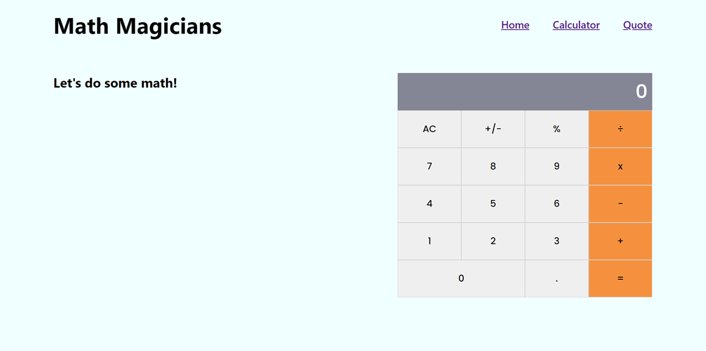

# Math Magicians

> "Math magicians" is a website for all fans of mathematics. It is a Single Page App (SPA) that allows users to:
- Make simple calculations.
- Read a random math-related quote.

## Screenshot

## Built With

- ReactJS
- CSS/SCSS

## Live site 🚀

🔗 [Netlify](https://626a88d7d11a7600b6919dd2--dewslyse.netlify.app/)

## Getting Started

To get a local copy up and running follow this simple step:

- Clone repository to your local machine: `git@github.com:dewslyse/math-magicians.git`
- `cd math-magicians`
- Run `npm install` to install dependencies
- Run `npm start` to start app

## Author

👤 **@dewslyse**

- GitHub: [@dewslyse](https://github.com/dewslyse)

## 🤝 Contributing

Contributions, issues, and feature requests are welcome!

Feel free to check the [issues page](../../issues/).

## Show your support

Give a ⭐️ if you like this project!

## Acknowledgments

- Hat tip to anyone whose code was used
- Inspiration
- etc

## 📝 License

This project is [MIT](./LICENSE) licensed.
